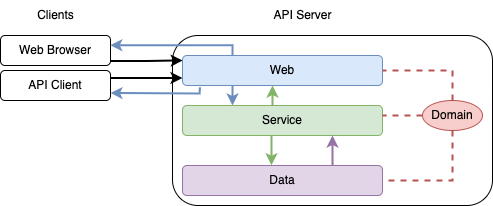

# Clip Stash
Web Service that allows to paste and share clipboard content.  
**Features:**  
- Link sharing
- Clip expiration
- JSON API
- Password protected clips

## Architecture


### Components
### Web
- Communicates wih outside world (clients):
  - Reports errors
  - renders pages
  - provides API
- Manages application state
  - Establishes database connections
  - Binds ports
  - Spawn background tasks
- Has no direct access to data layer/component. It must go through the Service component to get data.

### Service
- Intermediate layer between web requests and database.
  - can communicate with web and data components.
  - can't communicate with clients
- Abstracts user requests and data access
- Implements core application logic

### Database
- Manages data storage and retrieval
- Works directly with database
- No logic: only queries (no modification on ingoing/outgoing data)\
- Can only communicate with service component

### Domain
- Data types shared across components
- Enforces business rules on data
  - Domain objects cannot be created unless all rules satisfied

## Setup
### Database
1. Install `sqlx-cli`:
    ```commandline
    cargo install sqlx-cli
    ```
2. Create DB and run initial migration:
   ```commandline
    sqlx database setup
    ``` 
